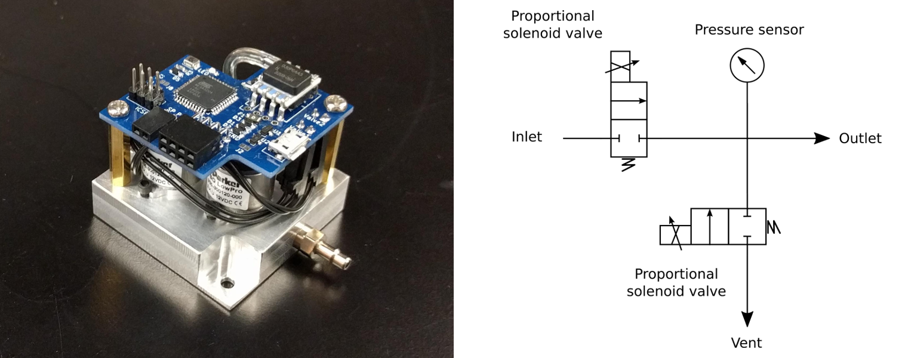

Electronic pressure regulator
------------------------------

This repository contains code for the electronic pressure regulator described in our [All-in-one microfluidics control system article](https://www.sciencedirect.com/science/article/pii/S2468067218301147). Please refer to the article for instructions on how to build and program these.

Details are also available on [Hackaday.io](https://hackaday.io/project/148274-electronic-pressure-regulator).

## How it works

Two proportional solenoid valves are used: one on the inlet to let pressurized air in (from a pump, gas tank, etc), thus raising the pressure. A second proportional solenoid valve can be opened to vent excess air and lower the pressure. A sensor on the outlet allows the microcontroller to regulate pressure rapidly and precisely using a PID loop. That's it!

Set points and current pressure values can be transmitted in 3 ways: over USB, i2c or analog. This way, the regulator can be included in all sorts of projects, whether as a benchtop tool or on a robot of some sort.
